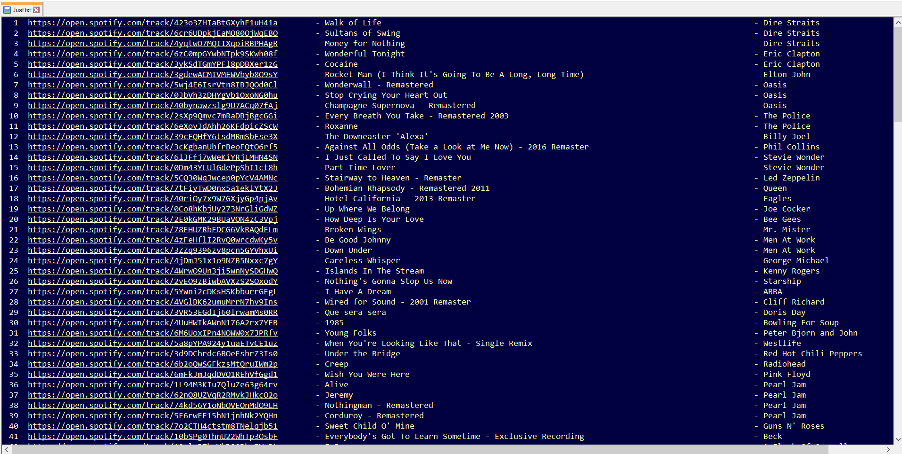

# Export Spotify Playlists
Export Spotify playlist data to either Text or CSV files using Spotipy and the WebAPI.

# Implementation Details
The code is written completely in python and I have used the recommended python library for using the Spotify WebAPI - Spotipy. The library makes working with the WebAPI easier than if you used the requests library in python directly. Output can be written either to a text (.txt) file or a CSV (.csv) file. For this to work, you will need some information about the way Spotify structures its data. They use URIs as unique identifiers for almost everything. So for example, every Spotify user has his unique URI, every Spotify playlist has its unique URI, as does every artist, album and so on. Further, for you to be able to use the WebAPI you must get yourself registered with Spotify so that you may be authorized. This is good because nobody can just access the database. But also, the registration process is fairly straightforward. You can find more information at [Spotify for Developers > WebAPI](https://developer.spotify.com/documentation/web-api/).

# Background 
The premise of the program is pretty obvious. This script lets you save your playlists outside of Spotify in text format. The text files can be used to maintain a readable database of your playlists in the event that you cannot access Spotify or somehow lose data. The CSV files on the other hand can be used to do other analysis on! I have sneaked a bonus, "Random Song Selecter" into the script as well.

# Getting around the file
## Libraries used
I have used the following libraries for various purposes in the script : 
* Spotipy - Install using `pip install spotipy`
* Pprint - Install using `pip install pprint`
* CSV module
* OS module
* Random module

## Control Variables
The control variables are the variables you can change to select what you want the script to do and with what. The variables I have used are - 
* mode - You can select whether you want to export to csv, txt or none. None would just select a random song form the playlist
* OVERWRITE - This is a boolean variable to choose whether you want to overwrite existing files or not.
* playlist - Used to select which playlist you want to use in the script.
* CLI_ID and CLI_KEY - They store your client ID and client secret that you can obtain after you have registered with Spotify.

Every function has a description in comments and explains what it does. You can select the show_ds mode of the script if you want to better understand what's going on in the write_txt() and write_csv() functions.

# Export Format
## TXT Files
* Track URL
* Track name
* Artist name(s)
* Total number of songs
* Owner's username

## CSV Files
* Track URL
* Track name
* Artist name(s)
* Explicit
* Popularity
* Duration in ms

# Screenshot

# Notes
You will have to add your own client details and your own paths. Everything else can be as is.