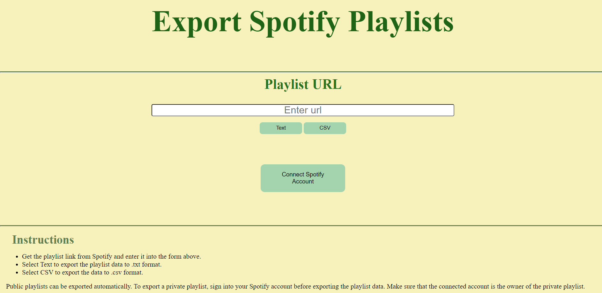

# Export Spotify Playlists
Export Spotify playlist data to either Text or CSV files using Spotipy and the WebAPI.

# Implementation Details
The application is written almost completely in python and I have used the recommended python library for the Spotify WebAPI - Spotipy. The library makes working with the WebAPI easier than if you used the python `requests` library directly. You can either run `spotify_exporter.py` directly or you can run `app.py`, open `http://localhost:5000` in your browser and follow along with the web app. The Flask app uses `spotify_exporter.py` and lets you login to your spotify account to export your playlists from the web app. Output can be written either to a text (.txt) file or a CSV (.csv) file. 

Spotify uses URIs as unique identifiers for almost everything. For example, every Spotify user has their unique URI, every Spotify playlist has its unique URI, as does every artist, album and so on. `spotify_exporter.py` requires the playlist URI, while the Flask app can extract the URI from the playlist's URL. Further, for you to be able to use the WebAPI you must get yourself registered with Spotify so that you may be authorized. This is good because nobody can just access the database. The registration process is fairly straightforward. You can find more information at [Spotify for Developers > WebAPI](https://developer.spotify.com/documentation/web-api/). If you use the Flask app, you still need to register using the link. 

# Background 
The premise of the program is pretty obvious. This application lets you save your playlists outside of Spotify in text or CSV format. The text files can be used to maintain a readable database of your playlists in the event that you cannot access Spotify or somehow lose data. The CSV files on the other hand can be used to do other analysis or can be plugged into another script to create identical playlists accross streaming services. I have sneaked a bonus, "Random Song Selecter" into the script as well.

# Getting around the file
## Libraries used
I have used the following libraries for various purposes in the script : 
* Spotipy - Install using `pip install spotipy`
* Pprint - Install using `pip install pprint`
* CSV module
* OS module
* Random module

The Flask app uses the following libraries :
* Flask 
* String module 
* Secrets module 
* Requests module 
* Urllib module

## Control Variables
The control variables in `spotify_exporter.py` are the variables you must change to select what you want the script to do. The Flask app requires the same information. The information required is - 
* mode - You can select whether you want to export to csv, txt or none. None would just select a random song form the playlist.
* OVERWRITE - This is a boolean variable to choose whether you want to overwrite existing files or not.
* playlist - Used to select which playlist you want to use in the script.
* CLI_ID and CLI_KEY - They store your client ID and client secret that you can obtain after you have registered with Spotify.

Every function has a description in comments and explains what it does. You can select the show_ds mode of the script if you want to better understand what's going on in the write_txt() and write_csv() functions.

# Export Format
## TXT Files
* Track URL
* Track name
* Artist name(s)
* Total number of songs
* Owner's username

## CSV Files
* Track URL
* Track name
* Artist name(s)
* Explicit
* Popularity
* Duration in ms

# Screenshots

# Notes
You will have to add your own client details and your own paths. If you use `spotify_exporter.py` directly, update this information in the `main()` function of the script. If you use the Flask web app, update this information in `app.py`. Everything else can be left as is.